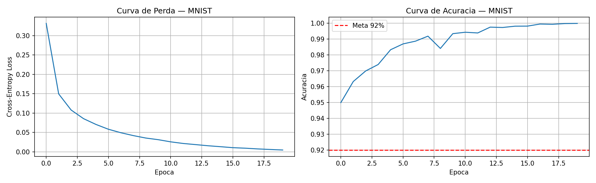

# Informações Gerais

**Nome:** João Pedro Gonçalves Corrêa Araujo
**Turma:** T16 - Eng Comp

### Objetivo da Atividade

Implementar um Multi-Layer Perceptron do zero, usando apenas NumPy. Sem PyTorch, TensorFlow ou qualquer framework de deep learning,cada operação de forward pass, backpropagation e atualização de pesos foi escrita manualmente.

### Criando um MLP do zero

O primeiro passo antes de construirmos uma MLP do zero, é entendermos como funciona uma MLP e como construir esse entendimento. O objetivo é entender a matemática por trás do Perpeptron e da criação de várias camadas. 

### O que é um Perceptron?

O Perceptron é o precursor de tudo que chamamos de rede neural hoje. Ele foi inspirado no funcionamento de um neurônio biológico: recebe sinais, decide se deve "disparar" ou não, e propaga essa decisão adiante.

Na sua forma mais simples, o Perceptron é um classificador. Ele recebe um vetor de entradas `x`, multiplica cada entrada por um peso `w`, soma tudo e aplica uma função degrau:


**A limitação do Perceptron simples:** ele só consegue separar dados linearmente separáveis. O problema clássico que expôs essa limitação foi o XOR, quatro pontos que nenhuma linha reta consegue separar em duas classes. Isso travou o campo por quase duas décadas, até que a combinação de múltiplas camadas e backpropagation resolveu o problema.

É exatamente aí que entra o **Multi-Layer Perceptron (MLP)**: ao empilhar vários perceptrons em camadas e conectá-los, a rede consegue aprender fronteiras de decisão não-lineares, representando funções arbitrariamente complexas.

### O que é um neurônio?

Um neurônio artificial é uma função simples: ele recebe entradas, multiplica cada uma por um peso, soma tudo, adiciona um viés e passa o resultado por uma função de ativação. Em notação matemática:

```
z = W · x + b
a = f(z)
```

Onde **W** são os pesos, **x** é a entrada, **b** é o viés e **f** é a função de ativação. Isoladamente, um neurônio não faz nada impressionante — é a composição de muitos deles em camadas que cria a capacidade de aprender padrões complexos.

### Forward Pass: propagando a informação

O forward pass é o processo de passar os dados de entrada pela rede camada por camada até obter uma predição. Cada camada aplica a operação `a = f(W · a_anterior + b)`, e a saída de uma camada vira a entrada da próxima. Na camada final, usamos softmax para converter os valores em probabilidades:

```
softmax(z)ᵢ = exp(zᵢ) / Σ exp(zⱼ)
```

Isso garante que as saídas somem 1 e possam ser interpretadas como "a probabilidade de ser o dígito X".

### Função de Perda: medindo o erro

Após o forward pass, precisamos medir o quanto a predição errou. Para classificação, usamos a cross-entropy:

```
L = -Σ yᵢ · log(ŷᵢ)
```

Onde `y` é o label correto (one-hot) e `ŷ` é a probabilidade predita. Quanto mais confiante a rede está no rótulo errado, maior a perda.

### Backpropagation: aprendendo com o erro

O backpropagation é a aplicação da regra da cadeia do cálculo para propagar o gradiente da perda de volta para cada peso da rede. A intuição é: se um peso contribuiu para o erro, ele deve ser ajustado proporcionalmente a essa contribuição.

Uma simplificação matemática muito elegante surge quando combinamos softmax com cross-entropy: o gradiente da camada de saída é simplesmente `ŷ - y`. A partir daí, o gradiente se propaga para trás camada a camada:

```
dW = a_anterior.T @ delta / N
delta_anterior = delta @ W.T * ReLU'(z)
```

O `*` aqui é multiplicação element-wise — cada neurônio recebe apenas o gradiente que lhe corresponde.

### SGD com Mini-batches: atualizando os pesos

Com os gradientes calculados, atualizamos os pesos na direção oposta ao gradiente (descida do gradiente):

```
W = W - taxa_aprendizado * dW
```

Em vez de calcular o gradiente com todos os dados de uma vez (o que seria lento), usamos mini-batches: pequenos subconjuntos dos dados a cada passo. Isso torna o treinamento mais rápido e o gradiente mais ruidoso, o que paradoxalmente ajuda a rede a escapar de mínimos locais ruins.

## Como rodar

```bash
# 1. Criar e ativar o ambiente virtual
python -m venv .venv
.venv\Scripts\activate        # Windows
# source .venv/bin/activate   # Linux/Mac

# 2. Instalar dependências
pip install -r requirements.txt

# 3. Rodar os experimentos
jupyter notebook notebooks/experimentos.ipynb
```

## Arquitetura escolhida

**Configuração final:** `[784 → 128 → 64 → 10]`

| Camada | Neurônios | Ativação |
|--------|-----------|----------|
| Entrada | 784 | — |
| Oculta 1 | 128 | ReLU |
| Oculta 2 | 64 | ReLU |
| Saída | 10 | Softmax |

**Por que essas escolhas:**

- **784 entradas:** imagens 28×28 achatadas em vetor.
- **ReLU nas camadas ocultas:** não sofre com o problema de gradiente que desaparece como a sigmoid, e sua derivada é simples (0 ou 1), o que torna o backprop eficiente.
- **Softmax na saída:** converte logits em probabilidades somando 1, combinado com cross-entropy produz um gradiente limpo: `ŷ - y`
- **He initialization:** pesos inicializados com `N(0, √(2/n))` — projetado especificamente para ReLU evitar saturação nas primeiras épocas
- **128 e 64 neurônios:** capacidade suficiente para aprender as features do MNIST sem overfitting excessivo


## Resultados

### Curva de loss e acurácia



### Tabela comparativa de experimentos

| Configuração | Acurácia Teste |
|---|---|
| Baseline `[784,128,64,10]` lr=0.01 | 96.73% |
| Maior learning rate lr=0.1 | 97.91% |
| Rede maior `[784,256,128,10]` lr=0.01 | 96.83% |
| Lote menor batch=32 | 96.83% |

## Decisões e dificuldades

### Qual foi a decisão técnica mais difícil que tomei?

A decisão mais difícil foi escolher os pesos no primeiro aprendizado da rede. Iniciar tudo simplesmente com zero faz com que a rede inteira calcule o mesmo gradiente.

Como solução, escolhi usar a função sqrt que He initialization que define pesos aleatórios escalados por √(2/n), onde n é o número de entradas da camada. O fator √(2/n) evita que esses valores iniciais sejam grandes demais e causem outro problema.

### O que tentei que não funcionou?

Tentei aumentar a quantidade de épocas de aprendizado completo do modelo para 100. O que aumentou a acurácia do modelo no treino para 99%, mas aumentou o tempo de execução exponencialmente, o que atrapalha muito quando estamos fazendo iterações no projeto.

Outra coisa foi definir learningRate (taxa de aprendizado) para 0.01, mas o modelo estava com aprendizado mais demorado e com menor acurácia. Quando eu aumentei para 0.1, o modelo apresentou resultados muito melhores, com acurácia de 97,91 para 0.1 e 96.65 para 0.01.

### Se fosse refazer do zero, o que faria diferente?


## Estrutura do repositório

```
├── README.md
├── mlp/
│   ├── __init__.py
│   ├── network.py      ← MLP com forward e backpropagation
│   ├── activations.py  ← ReLU e Softmax com derivadas
│   ├── losses.py       ← Cross-entropy
│   └── optimizers.py   ← SGD com mini-batches
├── notebooks/
│   └── experimentos.ipynb
├── results/
│   └── curvas_mnist.png
└── requirements.txt
```
